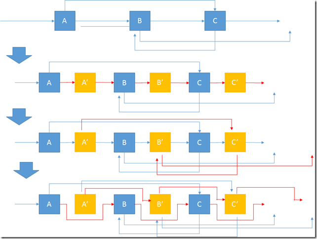

# 138. Copy List with Random Pointer

Solution 1  
第一遍遍历生成所有新节点时同时建立一个原节点和新节点的哈希表，第二遍给随机指针赋值时，查找时间是常数级。

Solution 2  
1. 在原链表的每个节点后面拷贝出一个新的节点  
2. 依次给新的节点的随机指针赋值，而且这个赋值非常容易 cur-&gt;next-&gt;random = cur-&gt;random-&gt;next  
3. 断开链表可得到深度拷贝后的新链表



Solution 3  
和方法一类似的伪递归。

```text
class Solution {
public:
    map<RandomListNode*,RandomListNode*>mp;
    RandomListNode *copyRandomList2(RandomListNode *head) {
        if(head==NULL)
            return NULL;
        if(mp.find(head)!=mp.end())
            return mp[head];
        RandomListNode *n=new RandomListNode(head->label);
        mp[head]=n;
        n->next=(copyRandomList2(head->next));
        n->random=(copyRandomList2(head->random));
        return n;
    }
    RandomListNode *copyRandomList(RandomListNode *head) {
        mp.clear();
        return copyRandomList2(head);
    }
};
```

